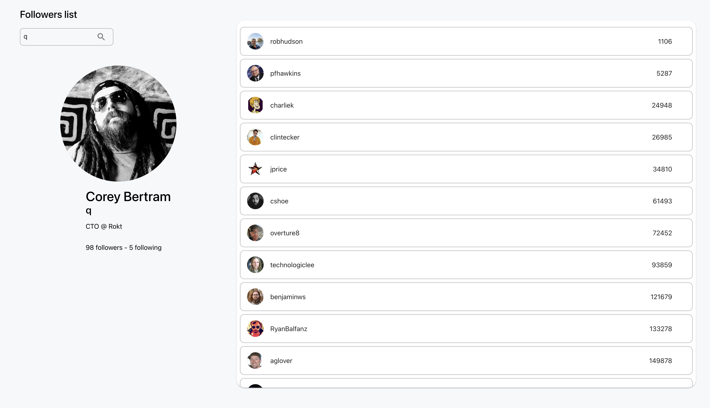

# Frontend Github followers app 

A React page that presents a search bar and a list.  
The search bar searches for a Github account, and shows his profile details, as well as a list of his followers.

* The user can search for any username on Github, by entering an input and clicking the search button (magnifying glass icon).
* The page will show the user details (name, number of followers and following, picture...) and a list of his followers (picture, number of followers...)

# Local run
You can view the app live on: https://github-app-tawny-theta.vercel.app/
 
To run locally: 
1. `npm install` `npm start`
2. View the project locally at http://localhost:3000

